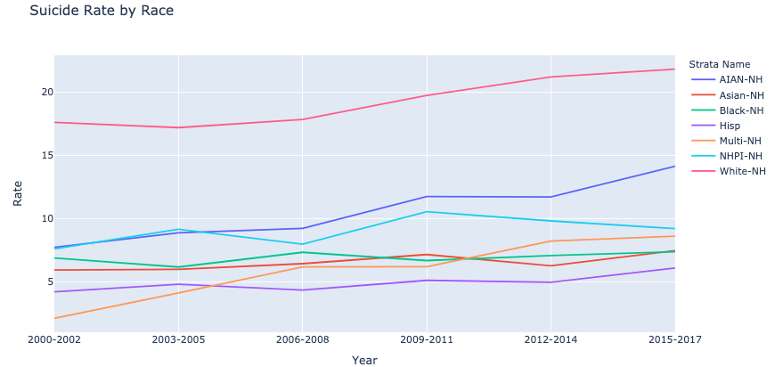
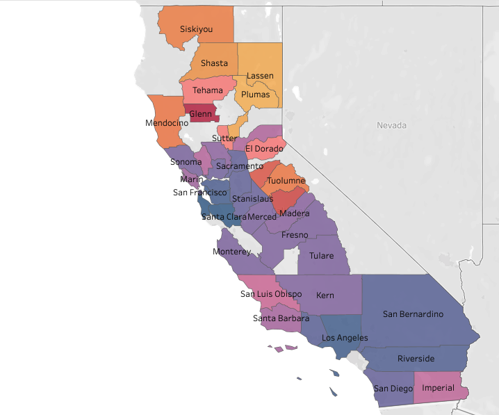
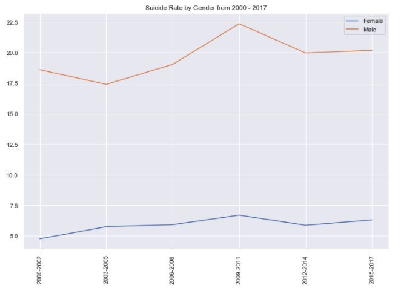

# Califonia_suicide_project

Nowadays, male suicide is a major social and medical problem. Globally, the proportion of men who die by suicide is 3–8 times higher than that of women.
In some Eastern European countries, such as Hungary, Latvia, Lithuania, Poland, and Slovakia, gender differences in suicide are particularly significant.
# More Insights From Data
## Data
The data is from data.world and it mainly contains the following columns:
Geography — This column contains cities of California and California itself.
Year — The year data is from 2000 to 2017.
Strata Name — This is the column of Gender — Male and Female.
Numerator — The Numerator is the number of people who committed suicide.
Denominator — The Denominator is the number of the total population.
Rate — Numerator/ Denominator which is the suicide rate.
Age-Adjusted Rate — The age-adjusted rates are rates that would have existed if the population under study had the same age distribution as the “standard” population.
## EDA
The chart below shows the trend of the suicide rate in California from 2000 to 2017. The suicide rate increased dramatically from 2005 to 2017.
During these years, people were suffered from the financial crisis, the income of the middle class in the United States has risen instead of falling. The gap between the rich and the poor in society has been widening. Many people’s bad economic conditions have gradually led to psychological changes, and they might lose confidence in life.

Based on the line chart below, we can see that race of white adults are at the highest risk for past-year suicide-related thoughts, followed by American Indian/Alaska Native and Native Hawaiian, and other Pacific Islanders. Asian and Hispanic adults are less likely to commit suicide.

This map shows the distribution of suicide rate — the redder the city is the higher the suicide rate it is. So we can see that most cities and counties at the top of the map have higher suicide rates. The county with the highest suicide rate is Trinity. Suicide rates are higher in rural parts of California, and Trinity County has experienced a rate of more than 30 suicides per 100,000 residents from 1999 and 2016. This record is almost triple the statewide rate. The reason might be scarce mental health care.

The bar chart shows the mean of suicide rate from 2000 to 2017. Suicide rate in Trinity is 41.56 which 3.74 higher than Glenn. Lnyo, the 3rd place, has the 32.29 suicide rate.

#
$“Men seek help for mental health less often. It’s not that men don’t have the same issues as women — but they’re a little less likely to know they have whatever stresses or mental health conditions that are putting them at greater risk for suicide.” — Harkavy-Friedman$
#
In 2014, the age-adjusted suicide rate for men was 20.7/100,000, which was more than three times that of women (5.8/100,000) in the United States[1]. Based on the 2000–2017 data of California, the average suicide rate of men is 3.4 times that of women.

Suicide rate of male is much higher than that of women. Most men stay ‘strong’ and quite, even though they are suffering and struggling and feel vulnerable. Women are more likely to share their stories and feelings so that their can release their pressure. This way is more helpful to avoid bad tings happen — suicide.
Conclusion
There are many reason why people commit suicide — education, job, income, economy, body conditions (chronic illness), temperature, social economy etc. Some relevant organizations or centers should put forward to efficient and strong prevention policies, programs, or methods to reducing suicide and the in rural areas where individual risk is highest.
National Suicide Prevention Lifeline
Hours: Available 24 hours. Languages: English, Spanish.
Learn more
1–800–273–8255
