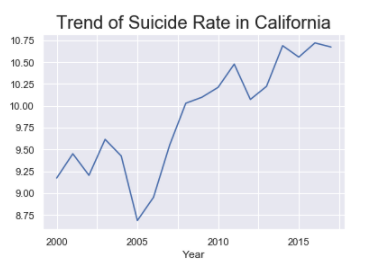

# Califonia_suicide_project

Nowadays, male suicide is a major social and medical problem. Globally, the proportion of men who die by suicide is 3–8 times higher than that of women.
In some Eastern European countries, such as Hungary, Latvia, Lithuania, Poland, and Slovakia, gender differences in suicide are particularly significant.
# More Insights From Data
## Data
The data is from data.world and it mainly contains the following columns:
Geography — This column contains cities of California and California itself.
Year — The year data is from 2000 to 2017.
Strata Name — This is the column of Gender — Male and Female.
Numerator — The Numerator is the number of people who committed suicide.
Denominator — The Denominator is the number of the total population.
Rate — Numerator/ Denominator which is the suicide rate.
Age-Adjusted Rate — The age-adjusted rates are rates that would have existed if the population under study had the same age distribution as the “standard” population.
## EDA
The chart below shows the trend of the suicide rate in California from 2000 to 2017. The suicide rate increased dramatically from 2005 to 2017.
During these years, people were suffered from the financial crisis, the income of the middle class in the United States has risen instead of falling. The gap between the rich and the poor in society has been widening. Many people’s bad economic conditions have gradually led to psychological changes, and they might lose confidence in life.

